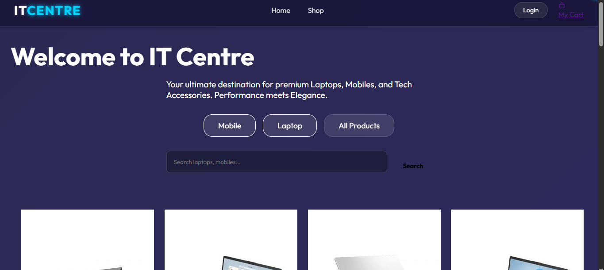
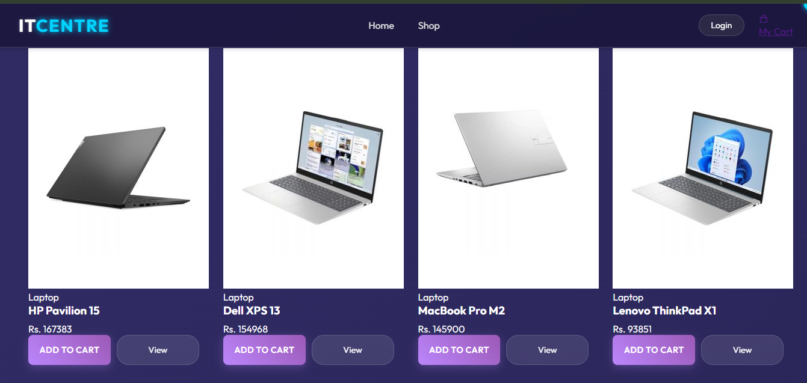
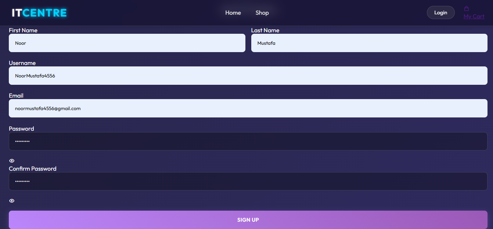
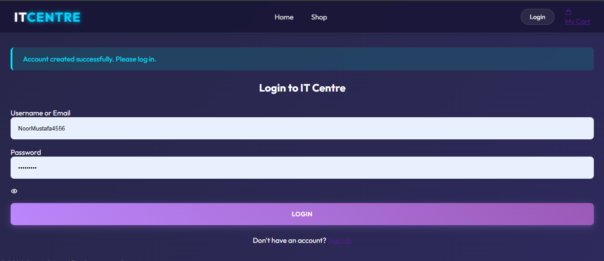
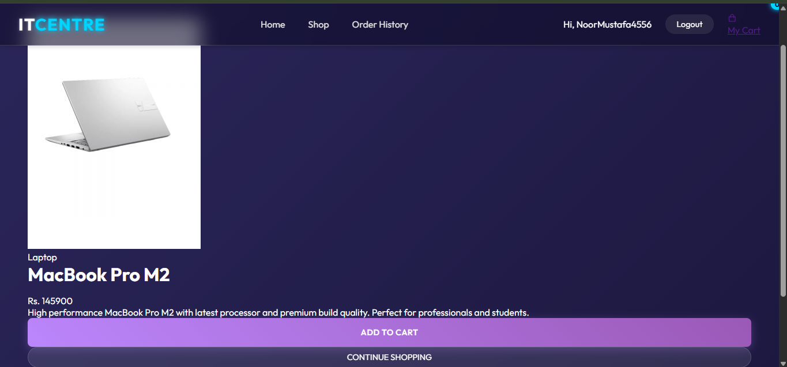
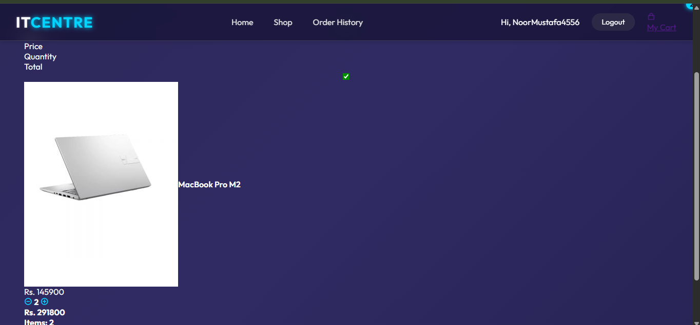
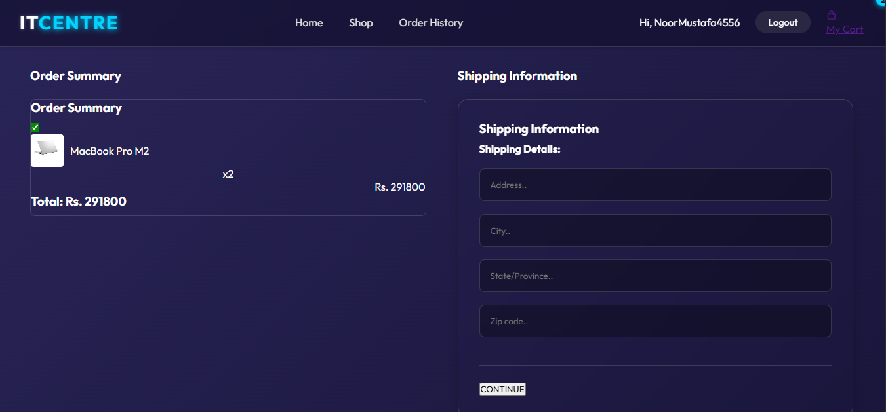
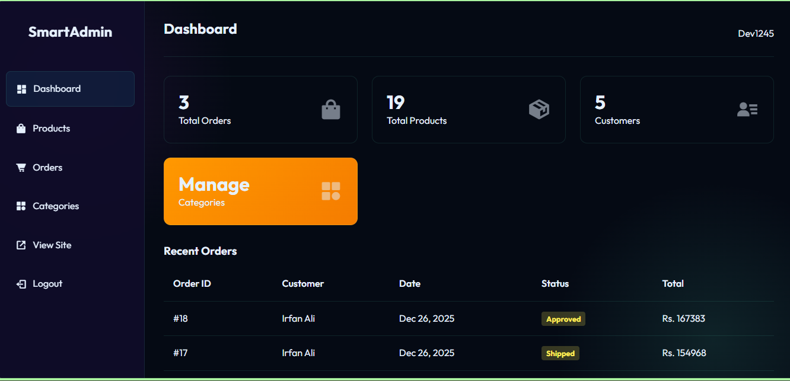

# 🛒 IT-Center-E-Commerce-App

**IT-Center-E-Commerce-App** is a dynamic, full-featured E-Commerce platform designed to provide a premium shopping experience for tech enthusiasts. It bridges the gap between technology and consumers, offering a streamlined interface for browsing, purchasing, and managing orders.

Built with **Django**, the system features a custom admin dashboard, secure user authentication, and a responsive design, tailored for managing an online tech store efficiently.


---


## 🚀 Key Features

- **Dynamic Storefront** – Showcase products with high-quality images and descriptions.
- **Smart Categorization** – Browse products by categories (Laptops, Accessories, Components).
- **Seamless Shopping Cart** – Add/remove items, update quantities, and view totals in real-time.
- **Secure Checkout** – Streamlined checkout process with shipping address management.
- **Order Tracking** – Customers can track order status (Pending &rarr; Processing &rarr; Shipped &rarr; Delivered).
- **Custom Admin Panel** – Dedicated dashboard for store managers to handle Products, Orders, and Customers.
- **User Accounts** – Secure signup, login, and order history management.

---

### 🛍️ User Experience
- **Customers** &rarr; Browse catalog, manage cart, place orders, and track history.
- **Admins** &rarr; Manage inventory, process orders, and oversee customer data.

### 🔎 Advanced Management
- **Product Management:** Add, edit, delete products with images and pricing.
- **Order Processing:** Update order statuses and view transaction details.
- **Category Control:** Organize products into logical groups for better navigation.

---

## 🛠 Tech Stack

| Area | Technology |
| :--- | :--- |
| **Backend Framework** | Django 5.x (Python) |
| **Frontend** | HTML5, CSS3, JavaScript |
| **Database** | SQLite (Default) |
| **Image Processing** | Pillow |
| **Templating** | Django Template Engine (DTL) |
| **Authentication** | Django Auth System |

---

## 📸 App Screenshots

<p align="center">
  
  
  
  
  
  
  
  
  <!-- Add more screenshots as needed -->
</p>

---

## 🔧 Getting Started

### Prerequisites
- Python 3.8+
- Git

**1. Clone the repository:**
```bash
git clone https://github.com/NoorMustafa4556/IT-Center-E-Commerce-App.git
```
```bash
cd IT-Center-E-Commerce-App
```

**2. Create and activate a virtual environment:**
```bash
python -m venv env
```
#### Windows
```bash
.\env\Scripts\activate
```
#### Mac/Linux
```bash
source env/bin/activate
```

**3. Install dependencies:**
```bash
pip install -r requirements.txt
```

**4. Apply migrations:**
```bash
python manage.py makemigrations
```
```bash
python manage.py migrate
```

**5. Create a Superuser:**
```bash
python manage.py createsuperuser
```

**6. Run the server:**
```bash
python manage.py runserver
```

---

# 👋🏻 Hi, I'm Noor Mustafa

A passionate and results-driven **Software Developer** from **Bahawalpur, Pakistan**, specializing in building elegant, scalable, and high-performance applications using **Django** and **Flutter**.

With a strong understanding of **Full-Stack Development**, **UI/UX principles**, and **API integration**, I aim to deliver solutions that are not only functional but also user-centric and visually compelling.

---

## 🚀 What I Do
- 💻 **Web Development** – Building robust web apps with Django & React.
- 📱 **Mobile App Development** – Creating cross-platform apps with Flutter.
- 🔗 **API Integration** – Connecting frontends to powerful RESTful APIs.
- 🔐 **Secure Systems** – Implementing secure authentication and role-based access.

---

## 🌟 Projects I'm Proud Of
- 🩸 **[Blood Link](https://github.com/NoorMustafa4556/Blood-Link-App-Flutter)** – A modern blood donation app connecting donors and recipients.
- 🛒 **[IT Center](https://github.com/NoorMustafa4556/IT-Centre-E-Commerce-App)** – A premium e-commerce platform for tech products.
- 🎓 **[UCMS](https://github.com/NoorMustafa4556/UCMS-University-Complaint-Management-System)** – A comprehensive university complaint management system.
- 🌤 **[Live Weather Check](https://github.com/NoorMustafa4556/Live-Weather-Check-App)** – Real-time weather forecast functionality.
- 🤖 **[AI Chatbot](https://github.com/NoorMustafa4556/Ai-ChatBot)** – Conversational AI powered by Google Gemini.

> 🎯 Check out all my repositories on [github.com/NoorMustafa4556](https://github.com/NoorMustafa4556?tab=repositories)

---

## 🧰 Tech Toolbox

<p align="left">
  
  
  
  
  
  
  
  
</p>

---

## 📫 Let's Connect!

<p align="left">
  <a href="https://x.com/NoorMustafa4556" target="blank">
    
  </a>
  <a href="https://www.linkedin.com/in/noormustafa4556/" target="blank">
    
  </a>
  <a href="https://www.facebook.com/NoorMustafa4556" target="blank">
    
  </a>
  <a href="https://instagram.com/noormustafa4556" target="blank">
    
  </a>
  <a href="https://wa.me/923087655076" target="blank">
    
  </a>
  <a href="https://www.tiktok.com/@noormustafa4556" target="blank">
    
  </a>
</p>

- 📍 **Location:** Bahawalpur, Punjab, Pakistan

---

> “Creating systems that solve real-world problems, one line of code at a time.”

---
